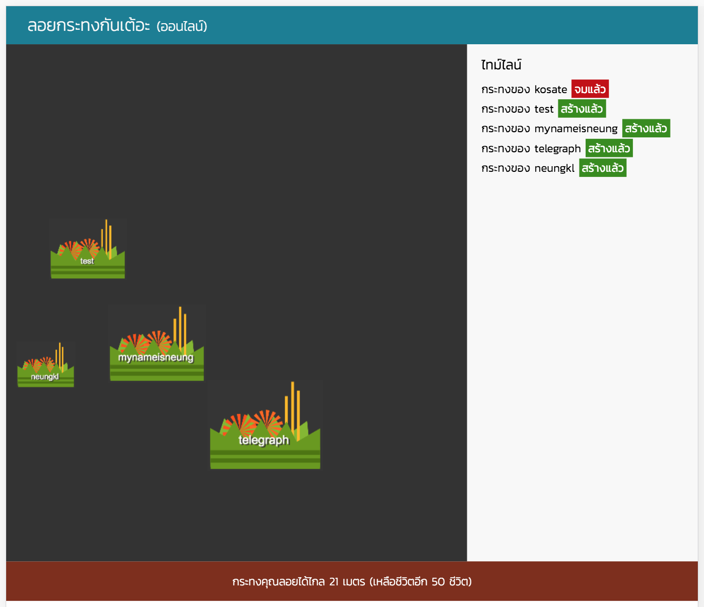

Loykrathong Online
===

Available demo here :D [https://loykrathong.herokuapp.com/](https://loykrathong.herokuapp.com/)

Loy Krathong is a festival celebrated annually in Thailand.

I've write some multi-player game web application for leading player
to flight together by clicking Krathong object in game.

You play as player. The task is so simple. Create a Krathong. Create with any name you want and may the luck be with you.

Other player will try to drowning your Krathong. No way to preventing these attacking. You must be fast. You must attack another player before player attack you.

Note :
I try to code this thing in one day. But I'm too late. 
My brain come up with this project at the night before festival. 
So sad it's too late but I'm still having fun with it.

## Usage

#### Client Usage

1. setup `config.js.default`
2. `mv config.js.default config.js`
3. `npm install && npm start`

#### Deploy to Heroku

1. Forget about `config.js`
2. Set some env variables `MONGODB_URI`, `SESSION_SECRET` (session encryption key)
3. Ready to deploy to Heroku.
